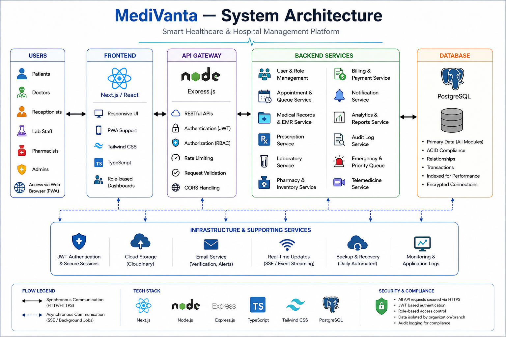
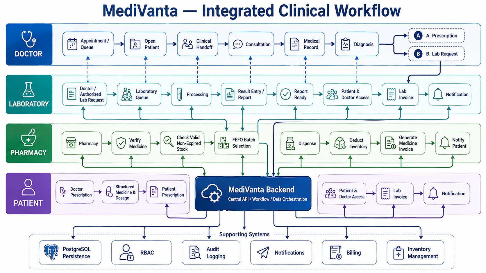
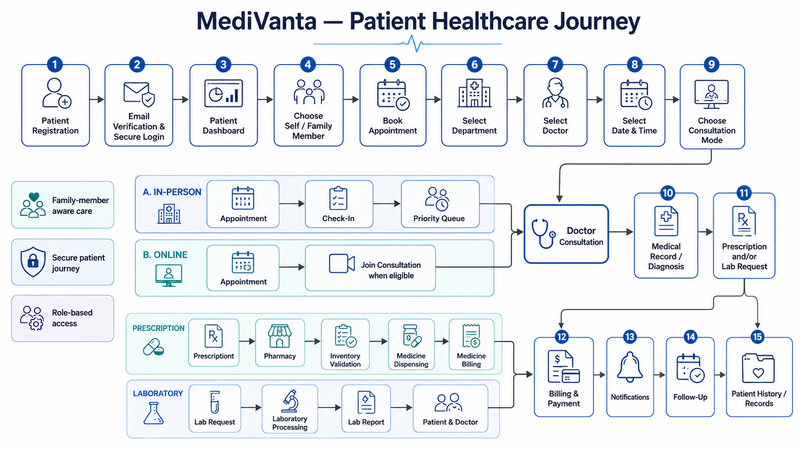
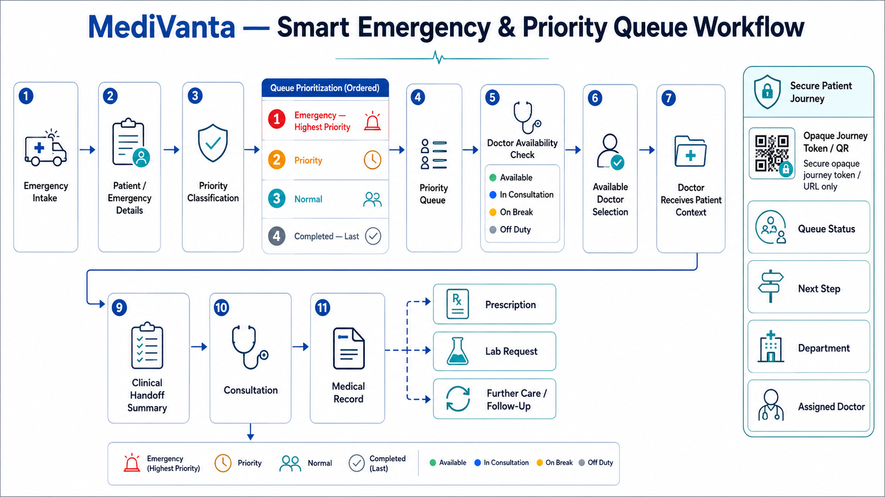

# 🏥 MediVanta — Integrated Smart Healthcare & Hospital Management Platform

> **Connecting patients, doctors, laboratories, pharmacies, reception, and hospital administration through one secure digital healthcare workflow.**

MediVanta is a full-stack healthcare and hospital management platform designed to connect the complete patient journey — from appointment booking and hospital check-in to consultation, medical records, laboratory testing, prescriptions, pharmacy dispensing, billing, follow-up, and hospital administration.

Instead of treating each hospital department as an isolated module, MediVanta creates an **integrated clinical and operational ecosystem** where information moves securely between authorized roles while maintaining role-based access, auditability, and organization-level data isolation.

---

## 🚀 Live Application

**Frontend:**  
https://medi-vanta-frontend.vercel.app/

**Backend API:**  
https://medivanta.onrender.com/

> The backend is hosted on a free-tier service and may require a short initial wake-up period after inactivity.

---

## 🎯 Problem Statement

Hospitals depend on multiple teams — receptionists, doctors, laboratory staff, pharmacists, administrators, and patients — but their workflows are often fragmented across disconnected systems.

This creates problems such as:

- fragmented patient information
- inefficient appointment and queue coordination
- disconnected prescription and pharmacy workflows
- manual inventory tracking
- delayed laboratory communication
- limited visibility into billing and payments
- difficulty prioritizing emergency patients
- poor coordination during patient handoffs
- limited operational visibility for administrators
- repeated data entry across departments

MediVanta addresses this by providing a **single role-aware healthcare platform** where clinical and operational workflows remain connected from beginning to end.

---

# 💡 Our Solution

MediVanta provides dedicated workspaces for:

- 👤 Patients
- 🩺 Doctors
- 🏢 Receptionists
- 🧪 Laboratory Staff
- 💊 Pharmacists
- 🛡️ Administrators

Each role receives only the information and actions required for its responsibilities.

The platform integrates:

**Appointment → Check-In → Queue → Consultation → Medical Record → Diagnosis → Prescription / Lab → Pharmacy → Billing → Notification → Follow-up**

into one connected workflow backed by PostgreSQL.

---

# ✨ Key Features

## 👤 Patient Care

Patients can:

- create and manage their healthcare account
- book appointments with hospital doctors
- choose between supported consultation modes
- reschedule or cancel eligible appointments
- view appointment status and history
- manage family/dependent members
- book healthcare services for family members
- access medical records
- access prescriptions
- view laboratory requests and reports
- view billing information and invoices
- record supported payments
- receive hospital notifications
- access follow-up information
- access patient journey information for linked visits
- participate in supported online consultation workflows

---

## 🩺 Doctor Workspace

Doctors can:

- view today's appointments
- identify the next eligible patient
- manage consultation workflow
- view patient information
- access clinical handoff context
- create medical records
- record diagnoses
- create structured prescriptions
- select medicines from the hospital medicine catalog
- specify dosage, unit, frequency and duration
- automatically calculate prescription quantities
- define follow-up dates
- edit eligible recent prescriptions
- view prescription and medical-record history
- print/save structured prescriptions
- view their queue
- manage operational availability status

### Doctor Operational Status

Doctors can use operational states such as:

- **Available**
- **In Consultation**
- **On Break**
- **Off Duty**

Consultation workflow can automatically update the doctor's operational state while preserving deliberate manual states such as break or off-duty status.

---

## 🏢 Reception & Queue Management

Reception staff can:

- manage appointments
- check patients into the hospital
- coordinate queue entries
- access relevant patient information
- manage operational billing workflows
- record supported manual payments
- search permitted hospital information
- coordinate patient movement through the hospital

Appointment and queue states remain synchronized with the hospital workflow.

---

## 🧪 Laboratory Management

Laboratory staff can:

- access laboratory requests
- manage request processing
- update laboratory workflow status
- enter results
- generate/report completed laboratory information
- make completed results available to authorized users
- receive relevant notifications

Laboratory activity is connected with patient records, doctors, billing and notifications.

---

## 💊 Pharmacy & Inventory Management

MediVanta includes persistent pharmacy inventory management.

Pharmacists can:

- maintain medicine inventory batches
- add and edit inventory
- track stock quantity
- track batch numbers
- track manufacturers
- manage unit prices
- monitor expiry dates
- define reorder levels
- identify low-stock medicines
- identify expired/near-expiry batches
- review issued prescriptions
- dispense medicines
- automatically deduct inventory after dispensing

### FEFO Dispensing

MediVanta uses **FEFO — First Expiry, First Out** logic.

When medication is dispensed:

1. the prescription's medicine is matched using its stable medicine identifier
2. expired inventory is excluded
3. required quantity is validated
4. eligible batches are ordered by expiry date
5. the earliest-expiring valid stock is consumed first
6. inventory is deducted
7. the prescription is marked as dispensed
8. medicine billing is generated
9. related notifications/audit information are recorded

This reduces medication wastage and prevents accidental dispensing from expired inventory.

---

## 💳 Billing & Payments

The platform contains PostgreSQL-backed billing infrastructure for clinical services.

Supported billing workflows include:

- consultation-linked invoices
- laboratory-linked invoices
- medicine-linked invoices
- itemized invoice charges
- paid and due amounts
- payment status
- patient billing view
- reception/admin billing view
- supported payment recording
- payment method/reference tracking
- printable invoice layouts

Source-linked invoice creation helps prevent duplicate billing for the same clinical event.

---

## 🔔 Notifications

MediVanta includes persistent per-user notifications.

Notifications can be generated for events such as:

- appointment creation
- appointment status changes
- laboratory requests
- laboratory workflow updates
- completed lab reports
- prescription issuance
- prescription dispensing
- invoice generation
- payment recording
- pharmacy stock warnings

Users can view unread notifications and mark individual or all notifications as read.

---

# 🚨 Smart Emergency & Priority Queue

MediVanta includes an emergency operations workflow designed to prioritize urgent hospital cases.

The operational queue follows priority logic such as:

1. active **Emergency** patients
2. active **Priority** patients
3. other active queue entries
4. completed entries

This prevents completed cases from appearing above patients who still require care.

Emergency operations can also coordinate doctor assignment using the doctor's operational availability.

Off-duty doctors are prevented from being silently assigned as normal available doctors.

---

# 🤝 Clinical Handoff

MediVanta provides doctors with a consolidated clinical context when reviewing patients.

Depending on available patient data, the handoff can surface information such as:

- reason for visit
- patient/dependent context
- allergies
- chronic/existing conditions
- blood group
- latest diagnosis
- recent laboratory information
- active prescription context
- pending laboratory requests
- visit status
- follow-up information

The handoff is derived from existing hospital and clinical records rather than requiring doctors to repeatedly re-enter the same information.

---

# 👨‍👩‍👧 Family & Dependent Care

Healthcare workflows frequently involve parents, children, elderly dependents and other family members.

MediVanta therefore supports family-member records that can be linked to healthcare activities.

Dependent context can flow through relevant areas such as:

- appointment booking
- laboratory requests
- prescriptions
- medical records
- doctor history
- patient-facing views
- consultation context
- billing context

This allows one authenticated patient account to coordinate care for supported family members while preserving their identity within clinical workflows.

---

# 💻 Telemedicine Foundation

MediVanta supports online consultation workflow foundations.

Online appointments can expose consultation access to authorized doctors and patients.

Access is appointment-scoped and time-aware so consultation actions are not exposed arbitrarily long before the scheduled appointment.

The current implementation focuses on secure consultation workflow and appointment context rather than building a complete custom video-conferencing infrastructure.

---

# 🔎 Role-Aware Global Search

MediVanta provides role-scoped hospital search.

Search behavior depends on the authenticated user's permissions.

Supported searchable entities can include:

- patients
- doctors
- departments
- appointments
- staff
- invoices
- medicines/inventory

Search results use entity-aware matching and open focused detail views rather than unnecessarily redirecting users into complete administrative listing pages.

Examples include:

### Doctor result

Can display:

- doctor
- department
- specialization
- qualification
- experience
- languages
- availability
- consultation information

### Department result

Can display:

- department
- doctor count
- available/on-duty doctor information
- location
- relevant doctor summary

### Pharmacy search

Can surface medicine-oriented information such as:

- medicine
- stock
- price
- batch
- expiry context

Search remains restricted according to role permissions.

---

# 📊 Administration & Hospital Operations

Administrators receive broader hospital oversight capabilities.

The administrative workspace includes functionality for:

- staff management
- user/account management
- account activation/deactivation
- hospital operational oversight
- billing oversight
- appointment oversight
- queue/emergency operations
- reports and analytics
- role-aware search
- active-session/security visibility
- audit-oriented operational information

Historical hospital data remains preserved when supported accounts are deactivated.

---

# 🏗️ System Architecture

MediVanta follows a full-stack client/server architecture with role-based application services and PostgreSQL persistence.



### High-Level Architecture

```text
                    ┌───────────────────────┐
                    │       MediVanta       │
                    │      Web Platform     │
                    └───────────┬───────────┘
                                │
                    ┌───────────▼───────────┐
                    │   Next.js Frontend    │
                    │ React + TypeScript    │
                    └───────────┬───────────┘
                                │
                          REST API Layer
                                │
                    ┌───────────▼───────────┐
                    │   Node.js / Express   │
                    │      Backend API      │
                    └───────────┬───────────┘
                                │
              ┌─────────────────┼─────────────────┐
              │                 │                 │
             RBAC          Business Logic     Audit/Security
              │                 │                 │
              └─────────────────┼─────────────────┘
                                │
                    ┌───────────▼───────────┐
                    │      PostgreSQL       │
                    │         Neon          │
                    └───────────────────────┘
```

---

# 🔄 Integrated Clinical Workflow

MediVanta connects the major hospital roles through a shared clinical workflow.



The workflow connects:

```text
Appointment
     ↓
Check-In
     ↓
Queue
     ↓
Doctor Consultation
     ↓
Medical Record + Diagnosis
     ↓
 ┌───────────────┬─────────────────┐
 │               │                 │
Prescription   Lab Request      Follow-up
 │               │
 ↓               ↓
Pharmacy       Laboratory
 │               │
Dispensing     Results
 │               │
 └───────┬───────┘
         ↓
       Billing
         ↓
   Notifications
         ↓
       Patient
```

Supporting services include:

- PostgreSQL persistence
- RBAC
- audit logging
- notifications
- billing
- inventory management

---

# 🧭 Patient Healthcare Journey

The patient journey extends beyond simply booking an appointment.



MediVanta connects the patient's progression through hospital services so that authorized roles can understand the current stage of care and the next operational step.

---

# 🚑 Emergency Workflow

Emergency patients require different handling from ordinary scheduled visits.



The emergency workflow connects intake, prioritization, queue management, doctor availability/assignment and subsequent clinical care.

---

# 🔐 Security & Access Control

Security is built into MediVanta's architecture rather than being handled only at the UI level.

Implemented security concepts include:

- authenticated protected workspaces
- role-based access control
- backend route authorization
- organization-scoped data
- patient-owned clinical data restrictions
- role-scoped search
- protected clinical operations
- authenticated session management
- session tracking/revocation support
- account activation/deactivation
- audit logging for important operations
- server-side validation
- safe API error handling

### Roles

```text
Patient
Doctor
Receptionist
Laboratory Staff
Pharmacist
Administrator
```

Each role receives only the operations required for its hospital responsibilities.

---

# 🛠️ Technology Stack

## Frontend

- Next.js
- React
- TypeScript
- Tailwind CSS
- Lucide React
- Responsive component-based UI

## Backend

- Node.js
- Express.js
- TypeScript
- REST APIs
- Server-side validation
- Role-based authorization

## Database

- PostgreSQL
- Neon PostgreSQL
- SQL migrations
- Persistent hospital operational data

## Deployment

- **Frontend:** Vercel
- **Backend:** Render
- **Database:** Neon PostgreSQL
- **Source Control:** GitHub

---

# 🗄️ Database & Persistence

MediVanta uses PostgreSQL as its persistent operational datastore.

The data model supports major hospital entities including:

```text
Organizations
Users
Patients
Family Members
Doctors
Departments
Appointments
Queue Entries
Medical Records
Prescriptions
Prescription Medicines
Lab Tests
Lab Requests
Inventory Batches
Invoices
Invoice Items
Payments
Notifications
Sessions
Audit Information
Patient Journey / Emergency Data
```

Database changes are managed using versioned migrations.

---

# 📁 Project Structure

```text
MediVanta/
│
├── frontend/
│   ├── src/
│   │   ├── app/
│   │   ├── components/
│   │   └── lib/
│   └── package.json
│
├── backend/
│   ├── migrations/
│   ├── src/
│   │   ├── auth/
│   │   ├── repositories/
│   │   ├── routes/
│   │   ├── services/
│   │   └── domain/
│   └── package.json
│
├── docs/
│   ├── diagrams/
│   │   ├── system-architecture.png
│   │   ├── clinical-workflow.png
│   │   ├── patient-healthcare-journey.png
│   │   └── emergency-workflow.png
│   │
│   └── screenshots/
│
├── package.json
└── README.md
```

---

# 🚀 Running MediVanta Locally

## 1. Clone the repository

```bash
git clone <your-repository-url>
cd MediVanta
```

---

## 2. Install dependencies

From the project root:

```bash
npm install
```

The repository uses npm workspaces for the frontend and backend.

---

## 3. Configure environment variables

Create the backend environment file using the provided example:

```powershell
Copy-Item backend/.env.example backend/.env
```

Configure the required values.

Example:

```env
PORT=4000
DATABASE_URL=your_postgresql_connection_string
CLIENT_ORIGIN=http://localhost:3000
SESSION_SECRET=your_secure_session_secret
```

Never commit real production secrets to Git.

Configure frontend environment variables according to `frontend/.env.example` when required.

---

## 4. Run database migrations

```bash
npm run db:migrate --workspace backend
```

---

## 5. Seed development data

For a fresh local development database:

```bash
npm run seed --workspace backend
```

---

## 6. Start MediVanta

Start the frontend and backend together:

```bash
npm run dev
```

Default development endpoints:

```text
Frontend: http://localhost:3000
Backend:  http://localhost:4000
```

---

# 👥 Demo Accounts

The development dataset includes role-specific demonstration accounts.

| Role | Email | Workspace |
|---|---|---|
| Patient | `patient@medivanta.demo` | `/dashboard/patient` |
| Doctor | `doctor@medivanta.demo` | `/dashboard/doctor` |
| Receptionist | `receptionist@Medivanta.demo` | `/dashboard/reception` |
| Laboratory Staff | `lab@Medivanta.demo` | `/dashboard/laboratory` |
| Pharmacist | `pharmacist@Medivanta.demo` | `/dashboard/pharmacy` |
| Administrator | `admin@Medivanta.demo` | `/dashboard/admin` |

> Demo credentials are intended only for development/evaluation. Production deployments should use securely provisioned accounts and secrets.

---

# 📸 Application Screenshots

Final screenshots are maintained under:

```text
docs/screenshots/
```

Recommended showcase views include:

- Landing Page
- Patient Dashboard
- Doctor Dashboard
- Clinical Handoff
- Digital Prescription
- Laboratory Workspace
- Pharmacy Inventory
- Billing
- Emergency Priority Queue
- Admin Analytics

---

# 🧪 Validation

The project is validated using:

```bash
npm run lint
npm run typecheck
npm run build
```

Database migrations can additionally be verified with:

```bash
npm run db:migrate --workspace backend
```

Core workflows have also been manually tested across Patient, Doctor, Receptionist, Laboratory, Pharmacy and Administrator roles.

---

# 🌐 Deployment Architecture

```text
                  USER
                    │
                    ▼
       ┌────────────────────────┐
       │         Vercel         │
       │   Next.js Frontend     │
       └────────────┬───────────┘
                    │ HTTPS
                    ▼
       ┌────────────────────────┐
       │         Render         │
       │ Express Backend API    │
       └────────────┬───────────┘
                    │ TLS
                    ▼
       ┌────────────────────────┐
       │          Neon          │
       │ PostgreSQL Database    │
       └────────────────────────┘
```

---

# 🌟 What Makes MediVanta Different?

MediVanta is not designed as a collection of disconnected CRUD dashboards.

Its key idea is **workflow continuity**.

A single healthcare event can move across multiple roles:

```text
Patient books appointment
        ↓
Reception coordinates arrival
        ↓
Queue manages patient flow
        ↓
Doctor performs consultation
        ↓
Prescription / Lab Request
        ↓
Pharmacy / Laboratory
        ↓
Inventory / Report
        ↓
Billing
        ↓
Patient notification and follow-up
```

Each department performs its own responsibility while MediVanta maintains the relationships between those actions.

Additional intelligence such as:

- emergency prioritization
- FEFO pharmacy dispensing
- doctor operational availability
- clinical handoff
- dependent-aware care
- patient journey tracking
- role-aware search

helps transform the platform from a simple hospital record system into an **integrated hospital operations platform**.

---

# 🔮 Future Enhancements

The current architecture provides a foundation for further enhancements such as:

- visual QR-based patient journey access
- advanced hospital bottleneck prediction
- intelligent appointment-slot optimization
- richer hospital capacity forecasting
- advanced pharmacy procurement and supplier workflows
- expanded EMR capabilities
- real payment gateway integration
- advanced downloadable clinical documents
- richer administrative analytics
- production-grade telemedicine media/signaling integration
- multi-hospital SaaS tenancy

---

# ⚠️ Disclaimer

MediVanta is currently a demonstration/hackathon healthcare software platform.

It is **not a certified medical device**, should not independently provide medical diagnoses, and should not be used as a substitute for professional clinical judgment or production hospital systems without appropriate security, compliance, validation and regulatory review.

---

# 🏥 MediVanta

### Integrated Healthcare. Connected Operations. Better Patient Journeys.

Built to demonstrate how modern software can connect clinical care and hospital operations through secure, role-aware digital workflows.
