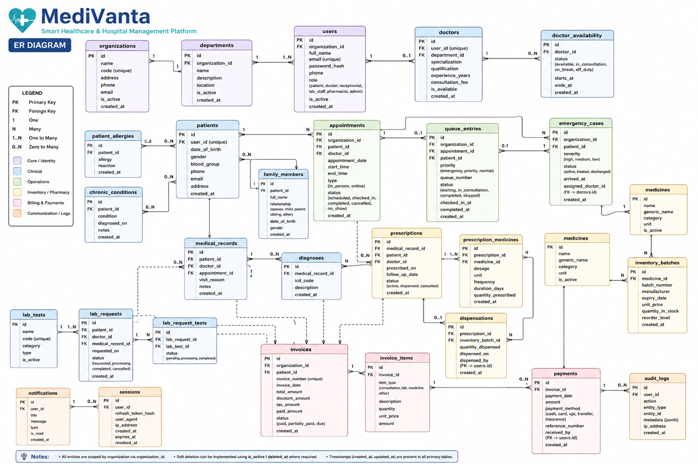
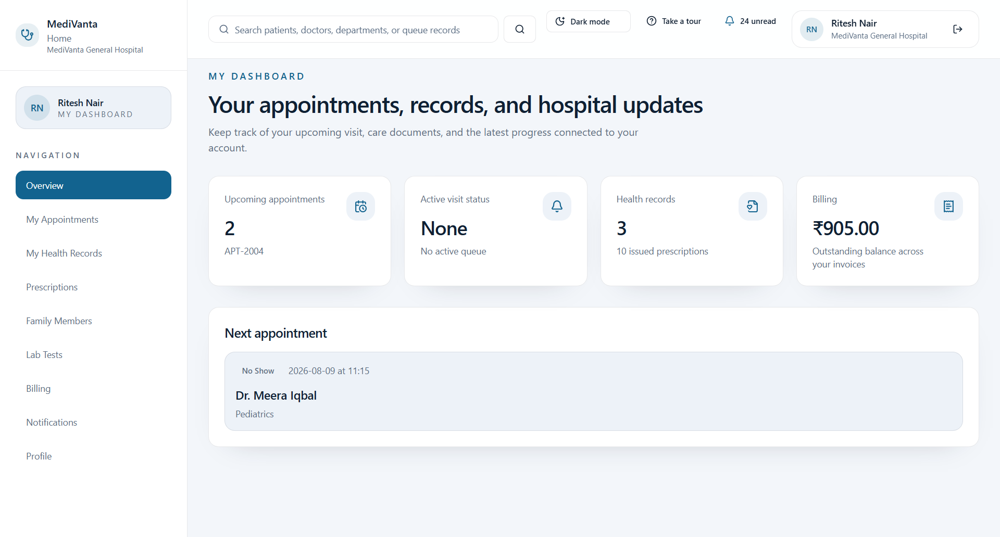
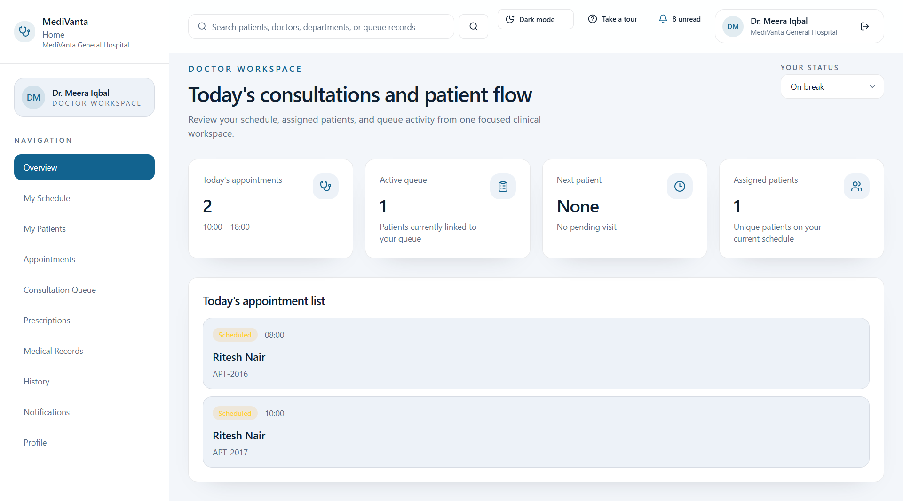
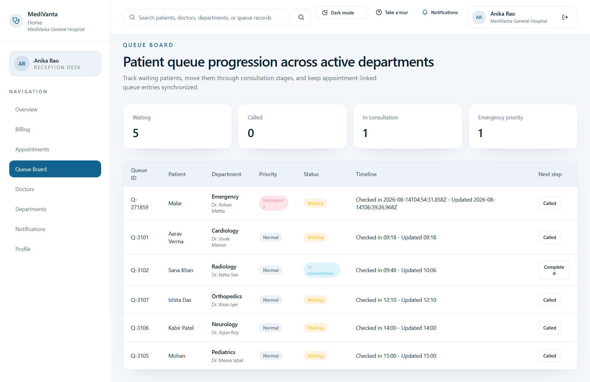
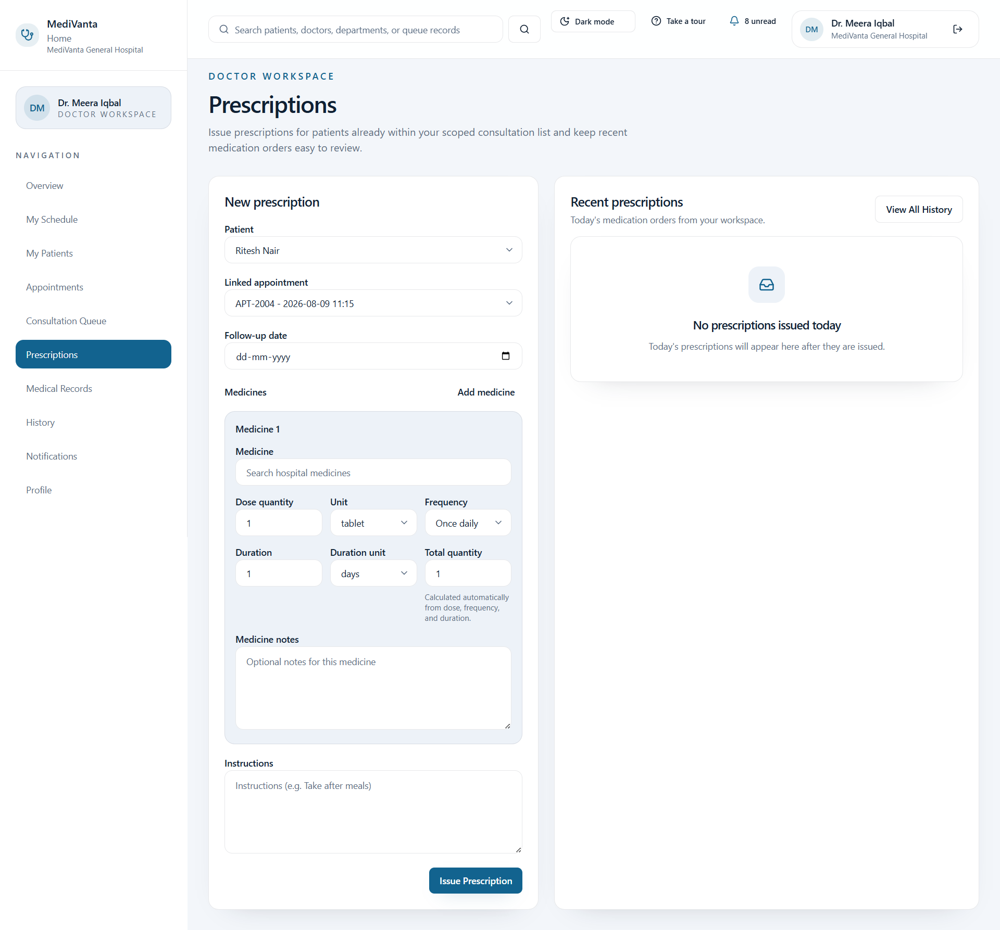
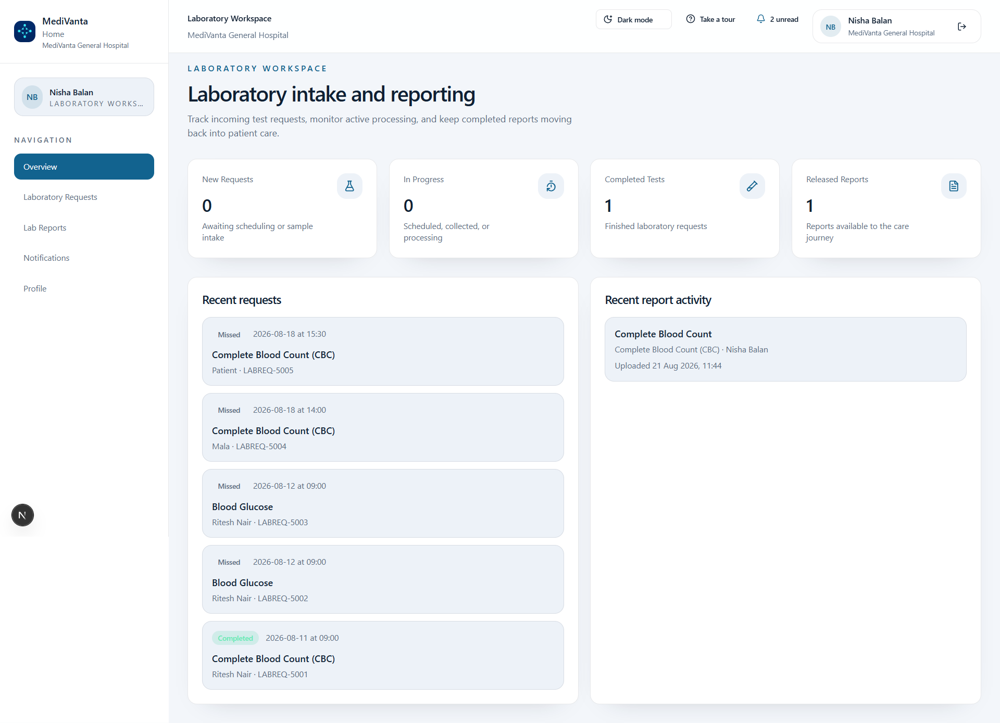
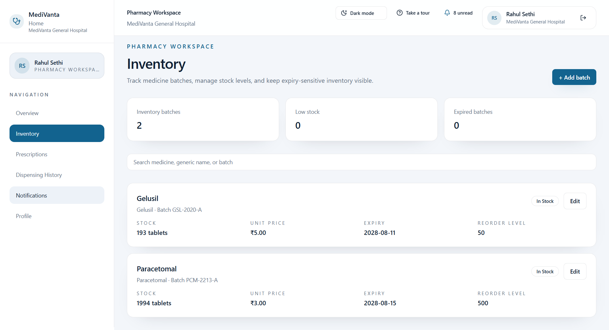
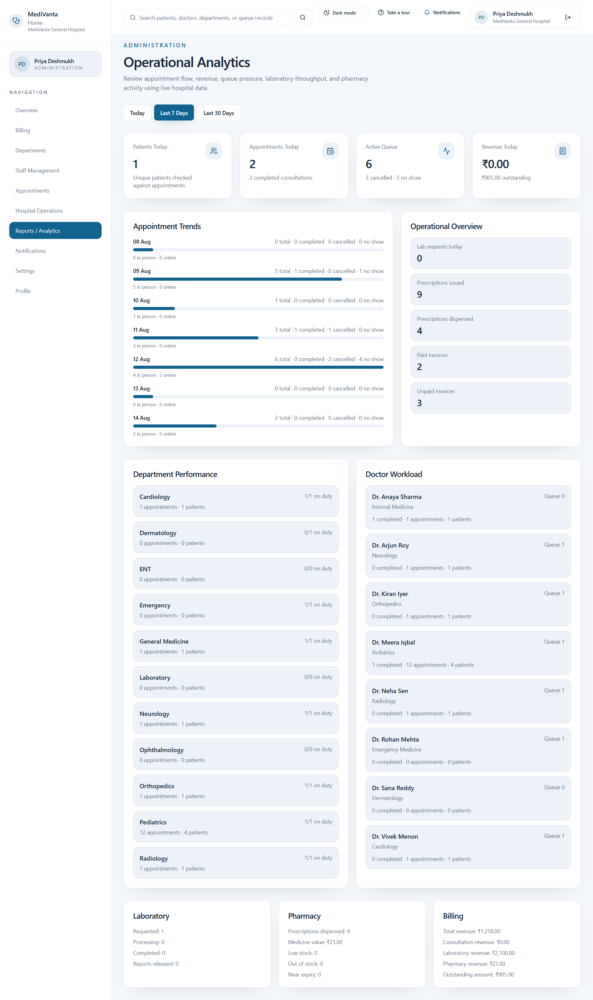

<div align="center">


# MediVanta

### Smart Healthcare & Hospital Management Platform

**Connected Care. Smarter Operations. Better Healthcare.**

</div>

**MediVanta** is a full-stack healthcare and hospital management platform that connects patients, doctors, receptionists, laboratory staff, pharmacists, and hospital administrators through one integrated digital ecosystem.

Instead of treating appointments, consultations, clinical records, diagnostics, prescriptions, pharmacy inventory, billing, emergency queues, telemedicine, and hospital administration as disconnected modules, MediVanta connects them through **role-based workflows, centralized APIs, and PostgreSQL-backed persistence**.

> **From appointment to consultation, diagnostics, medication, billing, follow-up, telemedicine, and emergency care — one connected hospital platform.**

---

## 🌐 Live Application

**Frontend:**  
https://medi-vanta-frontend.vercel.app

**Backend API:**  
https://medivanta-backend.onrender.com

---

# 🎯 Problem Statement

Hospitals involve multiple departments that continuously exchange patient, clinical, operational, and financial information.

When these workflows are handled through disconnected systems:

- Patient information becomes fragmented.
- Doctors may lack immediate clinical context.
- Emergency patients may not be prioritized efficiently.
- Laboratory and pharmacy workflows require repeated manual coordination.
- Inventory and prescriptions can become disconnected.
- Patients have limited visibility into their care journey.
- Billing may remain separated from actual clinical events.
- Administrators lack a unified operational view.
- Coordination between departments becomes slower and more error-prone.

**MediVanta addresses this problem through a unified, role-aware hospital platform where every major workflow contributes to a shared patient and hospital journey.**

---

# ✨ Core Capabilities

MediVanta integrates:

- 👤 Patient care
- 🩺 Doctor consultations
- 🏢 Reception and queue management
- 🚨 Emergency prioritization
- 💻 Telemedicine
- 🧪 Laboratory workflows
- 💊 Pharmacy and inventory
- 📦 Supplier and procurement workflows
- 💳 Billing and payments
- 🔔 Real-time notifications
- 📊 Hospital analytics
- 🏥 Hospital branch management
- 👨‍👩‍👧 Family/dependent care
- ⭐ Doctor ratings
- 📋 Clinical handoff
- 🔐 Role-Based Access Control
- 🧾 Audit logging

---

# 👤 Patient Care

Patients receive a dedicated healthcare workspace for managing their care journey.

### Features

- Secure patient authentication
- Email verification
- Patient profile management
- Appointment booking
- Appointment rescheduling and cancellation
- Department and doctor selection
- Date and time-slot selection
- In-person and online consultation modes
- Family member/dependent management
- Dependent-aware appointment booking
- Laboratory request tracking
- Lab report access
- Medical record access
- Prescription viewing
- Printable prescriptions
- Billing and invoice management
- Payment recording
- Notifications
- Telemedicine consultation access
- Follow-up information
- Doctor rating after completed appointments

Appointments that remain unattended beyond the permitted grace period are automatically reconciled as **No Show**, preventing stale scheduled appointments from remaining active indefinitely.

---

# 🩺 Doctor Workspace

Doctors receive a clinical workspace focused on consultation and patient-care workflows.

### Features

- Today's appointment overview
- Upcoming appointment management
- Appointment sorting
- Patient queue
- Next-patient information
- Assigned-patient visibility
- Doctor operational status
- Clinical handoff
- Patient clinical context
- Medical record creation
- Diagnosis recording
- Structured digital prescriptions
- Medicine selection
- Dosage and frequency management
- Duration management
- Automatic medicine quantity calculation
- Follow-up dates
- Prescription history
- Medical record history
- Lab request creation
- Telemedicine consultations
- Online consultation completion
- Patient rating summaries
- Branch assignment

### Doctor Operational Status

Doctors can maintain one of the following operational states:

- **Available**
- **In Consultation**
- **On Break**
- **Off Duty**

Consultation workflows can automatically update doctor availability while preserving deliberate manual status changes where appropriate.

---

# 🏥 Hospital Branch Management

MediVanta supports branch-aware hospital operations.

Administrators can:

- Create hospital branches
- Edit branch information
- Activate/deactivate branches
- Assign doctors to active branches
- Reassign doctor branches
- Select a hospital branch while creating doctor staff accounts

Branch assignment is validated at the backend rather than relying only on frontend controls.

This provides a foundation for multi-branch hospital operations while keeping organizational data properly scoped.

---

# 🏢 Reception & Front Desk

Reception staff coordinate day-to-day hospital activity without receiving unnecessary clinical privileges.

### Features

- Appointment oversight
- Patient check-in
- Appointment status management
- Queue coordination
- Emergency queue visibility
- Patient lookup
- Doctor availability visibility
- Billing access
- Invoice inspection
- Manual payment recording
- Notifications
- Role-scoped hospital search

---

# 🚨 Smart Emergency & Priority Queue

MediVanta includes an integrated emergency workflow for prioritizing urgent patients alongside regular hospital operations.

### Emergency Workflow

```text
Emergency Intake
       ↓
Patient / Emergency Details
       ↓
Priority Classification
       ↓
Priority Queue
       ↓
Doctor Availability Check
       ↓
Available Doctor Selection
       ↓
Clinical Handoff
       ↓
Consultation
       ↓
Medical Record
       ↓
Prescription / Lab Request / Follow-Up
```

### Queue Priority

Active queue entries are ordered with clinical urgency in mind:

1. 🚨 **Emergency — Highest Priority**
2. 🟠 **Priority**
3. 🔵 **Normal**
4. ✅ **Completed — Last**

Completed patients are prevented from appearing ahead of patients still waiting for care.

### Emergency Workflow Diagram


---

# 🧠 Clinical Handoff

MediVanta provides doctors with a consolidated **Clinical Handoff** before or during consultation.

Instead of forcing clinicians to manually inspect multiple disconnected pages, MediVanta derives relevant context from existing hospital records.

Depending on available information, the handoff can include:

- Patient/dependent context
- Reason for visit
- Known allergies
- Chronic conditions
- Blood group
- Latest diagnosis
- Recent laboratory information
- Active prescriptions
- Pending laboratory requests
- Visit status
- Follow-up information

The handoff is derived from existing records, reducing duplicate data entry.

---

# 👨‍👩‍👧 Family & Dependent Care

A patient can manage healthcare activities for family members or dependents through the same account.

Family-member information can be associated with:

- Appointments
- Laboratory requests
- Medical records
- Prescriptions
- Consultation context

This allows parents, guardians, or family members to coordinate care without incorrectly mixing the dependent's clinical information with the primary patient's records.

---

# 💻 Telemedicine

MediVanta supports appointment-scoped online consultations.

### Features

- Online/In-Person consultation selection
- Patient consultation access
- Doctor consultation access
- Camera access
- Microphone controls
- Consultation joining/leaving
- Appointment context
- Patient/dependent context
- Doctor-only consultation completion
- Automatic media cleanup after leaving
- Appointment workflow synchronization

### Time-Controlled Join Window

For an appointment scheduled at:

```text
09:00
```

the online consultation becomes available from:

```text
08:50 → 09:30
```

That corresponds to:

- **10 minutes before appointment time**
- **30 minutes after appointment time**

This rule is enforced by both the frontend and backend.

Completing an online consultation uses the same clinical completion workflow as other appointments so that related journey, notification, queue, and billing information remains synchronized.

---

# ⭐ Doctor Ratings

Patients can provide feedback for doctors after eligible completed appointments.

The rating workflow includes:

- Completed-appointment eligibility
- Patient-submitted doctor rating
- Rating updates where permitted
- Doctor average rating
- Rating count
- Patient rating history

This prevents arbitrary ratings unrelated to actual consultation activity.

---

# 🧪 Laboratory Management

Laboratory staff receive a dedicated diagnostic workspace.

### Features

- Laboratory request intake
- Requested test tracking
- Scheduling
- Sample collection
- Processing
- Report upload
- Report retrieval
- Patient/request context
- Laboratory notifications
- Patient and doctor report access
- Automatic billing linkage
- Stale-request reconciliation
- Sorting and status management

### Laboratory Lifecycle

```text
Requested
    ↓
Scheduled
    ↓
Sample Collected
    ↓
Processing
    ↓
Completed / Report Available
```

Laboratory requests that remain unattended beyond the permitted time window can automatically transition to:

```text
Missed
```

This prevents old laboratory requests from remaining permanently active.

Reports can only be uploaded during appropriate laboratory workflow states.

---

# 💊 Pharmacy & Inventory Management

MediVanta connects structured doctor prescriptions directly with hospital pharmacy inventory.

### Features

- Persistent medicine catalog
- Medicine batches
- Generic medicine information
- Manufacturer details
- Unit pricing
- Stock quantity tracking
- Expiry-date tracking
- Reorder levels
- Low-stock identification
- Near-expiry identification
- Expired-stock protection
- Prescription dispensing
- Prevention of double dispensing
- Automatic inventory deduction
- Dispensing history

---

## FEFO Stock Handling

Medication dispensing follows **First Expiry, First Out (FEFO)** logic.

```text
Doctor Prescription
        ↓
Medicine Verification
        ↓
Required Quantity Calculation
        ↓
Valid Non-Expired Batches
        ↓
Earliest Expiring Batch Selected
        ↓
Stock Validation
        ↓
Medicine Dispensed
        ↓
Inventory Deducted
        ↓
Invoice Generated
        ↓
Patient Notified
```

The system prevents inventory quantities from becoming negative and excludes invalid or expired stock.

---

# 📦 Suppliers & Procurement

MediVanta includes pharmacy procurement workflows for maintaining medicine inventory.

Supported capabilities include:

- Supplier listing
- Supplier search
- Supplier creation
- Supplier updates
- Supplier activation/deactivation
- Purchase-order creation
- Purchase-order updates
- Purchase-order cancellation
- Purchase-order receiving
- Inventory updates after receiving stock

This extends pharmacy management beyond dispensing into stock replenishment and procurement.

---

# 💳 Billing & Payments

Billing is connected directly with clinical and operational activity.

### Supported Billing

- Consultation billing
- Laboratory billing
- Medicine billing
- Itemized invoices
- Source-linked invoices
- Duplicate billing prevention
- Discounts
- Taxes
- Paid amount tracking
- Outstanding amount tracking
- Payment status
- Patient-side payment recording
- Reception/Admin payment recording
- Payment method tracking
- Payment reference tracking
- Printable invoices

Clinical events can therefore produce corresponding financial records instead of requiring independent manual billing workflows.

---

# 🔔 Real-Time Notification System

MediVanta provides persistent, user-specific notifications.

Notifications can be generated for events such as:

- Appointment creation
- Appointment status changes
- Laboratory request creation
- Laboratory status changes
- Lab report readiness
- Prescription issuance
- Prescription dispensing
- Invoice generation
- Payment recording
- Pharmacy stock conditions
- Other hospital workflow events

Users can:

- View unread notifications
- Mark individual notifications as read
- Mark all notifications as read

Real-time notification updates use **Server-Sent Events (SSE / Event Streaming)** with heartbeat and reconnection handling.

---

# 🔎 Role-Aware Global Search

MediVanta provides search results according to the authenticated user's role and permissions.

Searchable information can include appropriate combinations of:

- Doctors
- Departments
- Patients
- Appointments
- Staff
- Invoices
- Medicines
- Inventory
- Queue records

Access remains role-restricted.

For example:

- Administrators receive broad organizational results.
- Receptionists receive front-desk-relevant results.
- Doctors receive clinically appropriate results.
- Pharmacists receive medicine and inventory results.
- Patients remain restricted to safe patient-facing information.

---

# 📊 Hospital Administration & Analytics

Administrators receive centralized operational visibility across the hospital.

### Administrative Capabilities

- Staff management
- Account activation/deactivation
- Hospital branch management
- Doctor branch assignment
- Department management
- Appointment oversight
- Queue monitoring
- Emergency operations
- Billing oversight
- Notifications
- Role-scoped search
- Audit-oriented records

### Operational Analytics

MediVanta provides analytics across configurable reporting periods such as:

- **Today**
- **Last 7 Days**
- **Last 30 Days**

Analytics include:

- Patients handled
- Appointments
- Completed consultations
- Cancelled appointments
- No Shows
- Active queue
- Revenue
- Outstanding billing
- Appointment trends
- Department performance
- Doctor workload
- Laboratory activity
- Pharmacy activity
- Billing summaries

Analytics sections are isolated so that an optional metric failure does not unnecessarily crash the entire reporting page.

---

# 🔐 Security & Access Control

Healthcare applications require strict separation between patient, clinical, financial, pharmacy, and administrative workflows.

MediVanta applies authorization at both the **frontend workflow layer and backend API layer**.

### Security Concepts

- Authentication
- Secure session handling
- Protected dashboard routes
- Role-Based Access Control (RBAC)
- Capability-based backend authorization
- Organization-scoped data
- Branch-aware operations
- Patient-owned clinical information
- User-scoped notifications
- Protected pharmacy operations
- Protected billing operations
- Account activation/deactivation
- Secure password handling
- Request validation
- CORS handling
- Rate limiting
- Audit logging

Examples:

- Patients cannot access another patient's billing information.
- Pharmacists control inventory and dispensing.
- Doctors access authorized clinical workflows.
- Receptionists coordinate front-desk activity without unrestricted clinical privileges.
- Only authorized doctors can complete telemedicine consultations.
- Branch assignments are validated server-side.
- Laboratory workflow states are validated by the backend.

---

# 🏗️ System Architecture

MediVanta uses a full-stack client-server architecture with centralized PostgreSQL persistence.


### Architecture Overview

```text
Users
  │
  ▼
Next.js / React Frontend
  │
  │ HTTPS / REST
  ▼
Express.js API
  │
  ├── Authentication & RBAC
  ├── Appointment & Queue
  ├── Medical Records / EMR
  ├── Prescription
  ├── Laboratory
  ├── Pharmacy & Inventory
  ├── Billing & Payments
  ├── Notifications
  ├── Emergency Operations
  ├── Analytics
  ├── Audit Logging
  └── Telemedicine
  │
  ▼
PostgreSQL / Neon
```

Supporting infrastructure includes:

- JWT/session authentication
- Cloud file storage
- Email services
- SSE/Event Streaming
- Application logging
- Backup/recovery infrastructure

The backend remains the source of truth for clinical and operational workflows while frontend workspaces expose only role-appropriate functionality.

---

# 🔄 Integrated Clinical Workflow

MediVanta connects hospital departments through shared workflow state.


```text
Patient
   ↓
Appointment
   ↓
Check-In / Online Join
   ↓
Queue / Consultation
   ↓
Doctor
   ↓
Medical Record + Diagnosis
   ↓
 ┌──────────────────────┐
 │                      │
 ▼                      ▼
Lab Request         Prescription
 │                      │
 ▼                      ▼
Laboratory            Pharmacy
 │                      │
 ▼                      ▼
Lab Report          Dispensing
 │                      │
 └──────────┬───────────┘
            ▼
          Billing
            ↓
       Notifications
            ↓
         Follow-Up
```

---

# 🧭 Patient Healthcare Journey

MediVanta connects the complete patient journey instead of treating each department as an independent service.


A typical journey can include:

```text
Registration
     ↓
Secure Login
     ↓
Patient Dashboard
     ↓
Self / Family Member
     ↓
Book Appointment
     ↓
Department
     ↓
Doctor
     ↓
Date & Time
     ↓
In-Person / Online
     ↓
Consultation
     ↓
Medical Record
     ↓
Prescription / Laboratory
     ↓
Billing
     ↓
Notifications
     ↓
Follow-Up
     ↓
Patient History
```

MediVanta also provides secure opaque journey-token support for patient journey retrieval.

---

# 👥 Role-Based Workspaces

| Role | Primary Responsibilities |
|---|---|
| 👤 Patient | Appointments, family members, records, prescriptions, labs, billing, telemedicine, ratings |
| 🩺 Doctor | Consultations, patients, medical records, prescriptions, lab requests, clinical handoff, telemedicine |
| 🏢 Receptionist | Check-in, appointments, queue coordination, billing |
| 🧪 Laboratory Staff | Lab requests, sample processing, reports |
| 💊 Pharmacist | Inventory, medicine batches, dispensing, suppliers, procurement |
| 🛡️ Administrator | Staff, branches, operations, analytics, billing, emergency management |

---

# 🛠️ Technology Stack

## Frontend

- Next.js
- React
- TypeScript
- Tailwind CSS
- Responsive component-based UI
- Lucide Icons
- Light/Dark theme support
- Progressive Web App support

## Backend

- Node.js
- Express.js
- TypeScript
- REST APIs
- JWT/session authentication
- Role-Based Access Control
- Zod request validation
- Server-Sent Events

## Database

- PostgreSQL
- Neon PostgreSQL
- SQL migrations
- Persistent relational hospital data

## Infrastructure

- Cloud file storage
- Email services
- SSE/Event Streaming
- Application logging

## Deployment

- **Frontend:** Vercel
- **Backend:** Render
- **Database:** Neon PostgreSQL
- **Version Control:** Git & GitHub

---

# 🗄️ Data & Persistence

PostgreSQL acts as MediVanta's persistent source of truth.

The data model covers areas including:

- Organizations
- Hospital branches
- Users
- Sessions
- Departments
- Doctors
- Doctor availability
- Patients
- Family members
- Allergies
- Chronic conditions
- Appointments
- Queue entries
- Emergency cases
- Medical records
- Diagnoses
- Laboratory tests
- Laboratory requests
- Laboratory reports
- Prescriptions
- Prescription medicines
- Medicines
- Inventory batches
- Dispensing
- Suppliers
- Purchase orders
- Invoices
- Invoice items
- Payments
- Notifications
- Doctor ratings
- Telemedicine sessions
- Patient journey information
- Audit logs

Database changes are managed using versioned SQL migrations.

---

# 🗃️ Core Entity Relationship Diagram

The following diagram presents the **major/core relational entities** used by MediVanta.

Some supporting entities introduced in later workflow extensions may not be represented in this simplified overview.



---

# 📁 Project Structure

```text
MediVanta/
│
├── frontend/
│   ├── src/
│   │   ├── app/
│   │   ├── components/
│   │   └── lib/
│   └── package.json
│
├── backend/
│   ├── src/
│   │   ├── auth/
│   │   ├── domain/
│   │   ├── middleware/
│   │   ├── repositories/
│   │   ├── routes/
│   │   ├── services/
│   │   └── scripts/
│   ├── migrations/
│   └── package.json
│
├── docs/
│   ├── diagrams/
│   ├── screenshots/
│   └── demo/
│
└── README.md
```

---

# 🚀 Getting Started

## 1. Clone the Repository

```bash
git clone https://github.com/S-KavyaSuresh/MediVanta.git
cd MediVanta
```

## 2. Install Dependencies

```bash
npm install
```

## 3. Configure Environment Variables

### Frontend

```env
NEXT_PUBLIC_API_BASE_URL=http://localhost:4000
```

### Backend

```env
PORT=4000
CLIENT_ORIGIN=http://localhost:3000
DATABASE_URL=your_postgresql_connection_string
SESSION_SECRET=your_secure_session_secret
```

Additional environment variables may be required for configured email or cloud-storage integrations.

> Never commit production credentials or secrets to Git.

## 4. Run Database Migrations

```bash
npm run db:migrate --workspace backend
```

## 5. Seed Development Data

```bash
npm run seed --workspace backend
```

## 6. Start MediVanta

```bash
npm run dev
```

Default local endpoints:

```text
Frontend: http://localhost:3000
Backend:  http://localhost:4000
```

---

# 🎥 Demo Video

Watch the MediVanta end-to-end demonstration covering the major hospital roles and connected workflows.

▶️ **[Watch the MediVanta Demo Video](DEMO_VIDEO_URL)**

### Demonstrated Workflows

- Patient appointment journey
- Family/dependent care
- Doctor consultation
- Clinical handoff
- Medical records
- Digital prescriptions
- Telemedicine
- Laboratory workflow
- Pharmacy dispensing
- FEFO inventory management
- Billing and payments
- Emergency priority queue
- Doctor assignment and availability
- Hospital analytics
- Branch management
- Role-based administration

---

# 🔐 Demo / Test Accounts

MediVanta includes demonstration accounts for each supported hospital role.

> **Password for all demo accounts:** `Medi2026!Care`

| Role | Email | Password | Workspace |
|---|---|---|---|
| 👤 Patient | `patient@medivanta.demo` | `Medi2026!Care` | `/dashboard/patient` |
| 🩺 Doctor | `doctor@Medivanta.demo` | `Medi2026!Care` | `/dashboard/doctor` |
| 🏢 Receptionist | `receptionist@Medivanta.demo` | `Medi2026!Care` | `/dashboard/reception` |
| 🧪 Laboratory Staff | `lab@Medivanta.demo` | `Medi2026!Care` | `/dashboard/laboratory` |
| 💊 Pharmacist | `pharmacist@Medivanta.demo` | `Medi2026!Care` | `/dashboard/pharmacy` |
| 🛡️ Administrator | `admin@medivanta.demo` | `Medi2026!Care` | `/dashboard/admin` |

These credentials are intended exclusively for demonstration and project evaluation.

---

# 📸 Application Preview

## Patient Dashboard



## Doctor Dashboard



## Emergency Priority Queue



## Issuing Digital Prescriptions



## Laboratory Workspace



## Pharmacy Inventory



## Hospital Analytics



---

# ✅ Validation

The frontend and backend can be validated using:

```bash
npm run lint
npm run typecheck
npm run build
```

Database migrations:

```bash
npm run db:migrate --workspace backend
```

The final build has also been manually tested across the major role-based workflows, including:

- Authentication
- Appointment lifecycle
- No Show reconciliation
- Emergency queue
- Doctor consultations
- Telemedicine join window
- Telemedicine media cleanup
- Online consultation completion
- Medical records
- Prescriptions
- Laboratory request lifecycle
- Missed laboratory reconciliation
- Lab report upload
- Pharmacy dispensing
- Inventory deduction
- Billing
- Doctor branch assignment
- Hospital analytics
- Notifications
- RBAC enforcement

---

# 🌐 Deployment Architecture

```text
User Browser
     │
     ▼
┌─────────────────────┐
│       Vercel        │
│   Next.js Frontend  │
└──────────┬──────────┘
           │
           │ HTTPS / API Rewrite
           ▼
┌─────────────────────┐
│       Render        │
│    Express.js API   │
└──────────┬──────────┘
           │
           │ TLS
           ▼
┌─────────────────────┐
│        Neon         │
│     PostgreSQL      │
└─────────────────────┘
```

### Production URLs

🌐 **MediVanta**

https://medi-vanta-frontend.vercel.app

⚙️ **MediVanta API**

https://medivanta-backend.onrender.com

The deployed frontend can proxy `/api/*` requests to the configured backend using the Next.js rewrite configuration.

---

# 💡 What Makes MediVanta Different?

MediVanta is designed around **connected workflows rather than isolated CRUD modules**.

### Prescription → Pharmacy → Billing

```text
Doctor Consultation
        ↓
Structured Prescription
        ↓
Medicine & Dosage
        ↓
Pharmacy Verification
        ↓
Valid Inventory Check
        ↓
FEFO Batch Selection
        ↓
Medicine Dispensing
        ↓
Inventory Deduction
        ↓
Medicine Invoice
        ↓
Patient Notification
```

### Laboratory Workflow

```text
Doctor / Patient Lab Request
        ↓
Laboratory Queue
        ↓
Scheduling
        ↓
Sample Collection
        ↓
Processing
        ↓
Report
        ↓
Patient + Doctor Access
        ↓
Billing
        ↓
Notification
```

### Emergency Workflow

```text
Emergency Intake
        ↓
Priority Classification
        ↓
Priority Queue
        ↓
Doctor Availability
        ↓
Doctor Assignment
        ↓
Clinical Handoff
        ↓
Consultation
        ↓
Medical Record
```

### Online Consultation

```text
Online Appointment
        ↓
Controlled Join Window
        ↓
Patient + Doctor Join
        ↓
Telemedicine Consultation
        ↓
Doctor Completes Session
        ↓
Appointment Completed
        ↓
Clinical Journey Updated
        ↓
Billing + Notification
```

This allows MediVanta to model how real hospital departments **interact with one another**, rather than implementing each role as an independent application.

---

# 🔮 Future Enhancements

Potential future extensions include:

- AI-assisted hospital bottleneck detection
- AI appointment slot optimization
- Predictive waiting-time estimation
- Advanced inventory demand forecasting
- Real payment gateway integration
- Expanded EMR capabilities
- Advanced telemedicine infrastructure
- Multi-hospital SaaS tenancy
- Predictive hospital analytics
- Native mobile applications
- FHIR/HL7 interoperability
- Advanced regulatory and healthcare compliance tooling

---

# ⚠️ Disclaimer

MediVanta is currently an **academic/hackathon healthcare software project**.

It demonstrates healthcare workflow management, hospital information-system architecture, and integrated clinical/operational software concepts.

It is **not intended for real clinical deployment without additional regulatory, privacy, security, reliability, infrastructure, and medical-system validation**.

---

# 🏥 MediVanta

### **Connected Care. Smarter Operations. Better Healthcare.**

Built to demonstrate how patients, clinicians, diagnostics, pharmacy, billing, telemedicine, emergency care, and hospital administration can operate through **one connected digital healthcare platform**.
